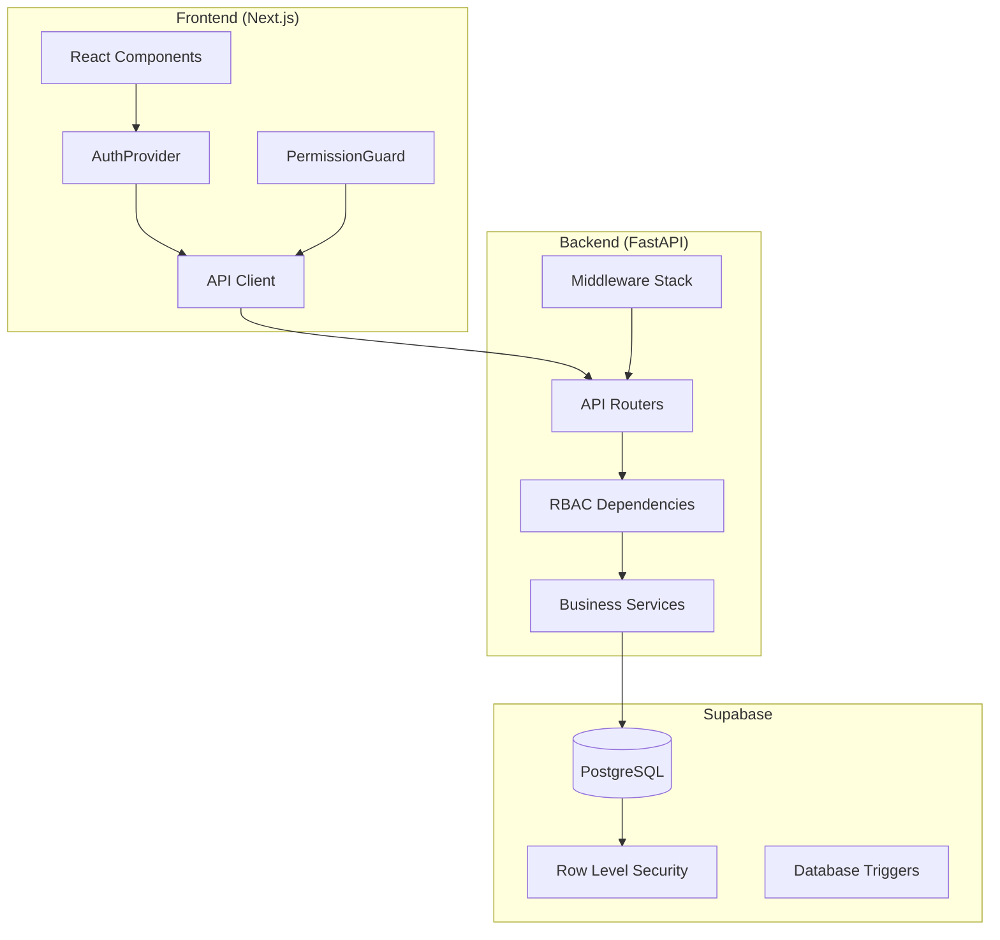
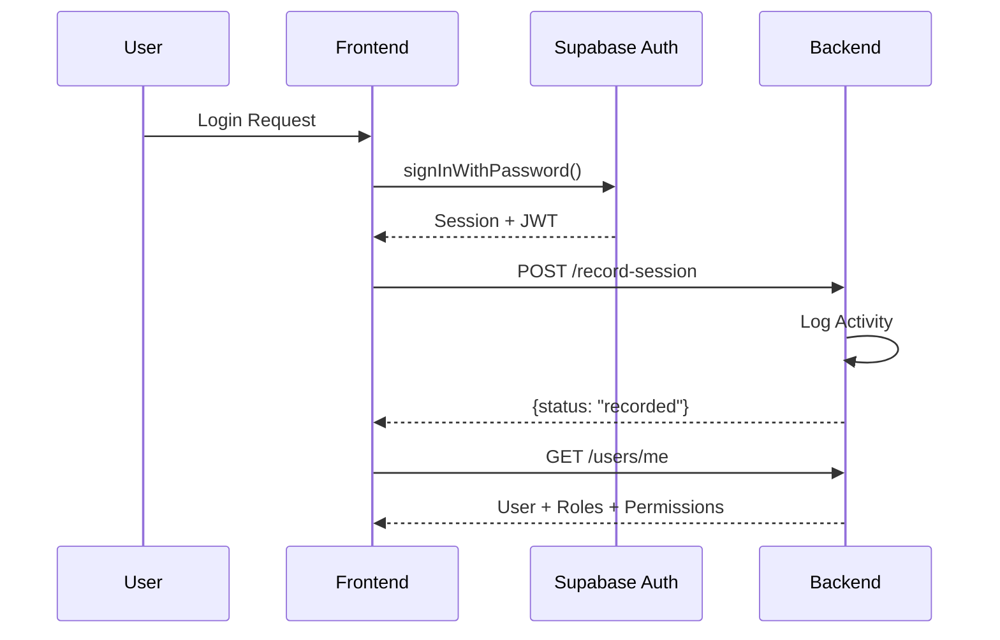

# Venus-System Comprehensive Audit Report

**Audit Date:** 2026-01-16  
**System Version:** 1.0.0  
**Auditor:** Antigravity AI  
**Classification:** Internal - Confidential

---

## Executive Summary

This report presents a comprehensive audit of the Venus-System, a full-stack enterprise application for poultry retail business management. The system was analyzed across three key dimensions: **Security**, **Performance**, and **System Integrity/Failure Points**.

### Overall Assessment

| Category | Rating | Status |
|----------|--------|--------|
| **Security** | ⭐⭐⭐⭐ | Good - Minor improvements recommended |
| **Performance** | ⭐⭐⭐⭐ | Good - Some optimization opportunities |
| **System Integrity** | ⭐⭐⭐⭐ | Good - Few edge cases identified |

---

## 1. Architecture Overview

### 1.1 Technology Stack

| Layer | Technology |
|-------|------------|
| **Frontend** | Next.js 14 (App Router), React, TypeScript, Tailwind CSS |
| **Backend** | FastAPI (Python), Pydantic, Uvicorn |
| **Database** | Supabase (PostgreSQL with RLS) |
| **Authentication** | Supabase Auth + JWT |
| **AI Integration** | NVIDIA NIM API (LLaMA 3.3 70B) |

### 1.2 System Components



---

## 2. Security Audit

### 2.1 Authentication & Authorization

#### ✅ Strengths

| Feature | Implementation | Status |
|---------|---------------|--------|
| **JWT Authentication** | Supabase JWT with HS256, audience validation | ✅ Secure |
| **Token Expiration** | 30-minute access tokens | ✅ Configured |
| **RBAC System** | Granular role & permission-based access | ✅ Comprehensive |
| **Field-Level Security** | User data fields filtered by permission | ✅ Advanced |
| **Multi-Tenant Isolation** | Store-based access control | ✅ Implemented |

#### ⚠️ Recommendations

| Issue | Severity | Recommendation |
|-------|----------|----------------|
| **Default SECRET_KEY** | 🔴 High | Change `SECRET_KEY` from default value in production via `.env` |
| **Docs Exposed in Dev** | 🟡 Medium | `/docs` and `/redoc` disabled in production - good, but verify deployment |
| **Session Tracker Error Handling** | 🟢 Low | Uses `verify_token` which may not exist - uses silent fallback |

#### 2.1.1 RBAC Implementation Details

The system implements a sophisticated role-based access control:

```
User → user_roles → Roles → role_permissions → Permissions
      └→ user_shops → Shops (Multi-tenant isolation)
```

**Key Dependencies:**
- [require_role](file:///Users/gopalsmac/Documents/Venus-System/backend/app/dependencies/rbac.py#L17-60): Role-based endpoint protection
- [require_permission](file:///Users/gopalsmac/Documents/Venus-System/backend/app/dependencies/rbac.py#L63-111): Permission-based endpoint protection

---

### 2.2 Row Level Security (RLS)

#### ✅ Tables with RLS Enabled

| Table | Policy Type | Description |
|-------|-------------|-------------|
| `user_shops` | Admin/User | Admins see all, users see own |
| `daily_shop_prices` | Admin/Manager | Store-scoped access |
| `app_activity_logs` | Admin/User | Admins see all, users see own |
| `profiles` | Admin/User | Admins can view all profiles |

#### ⚠️ RLS Concerns

| Concern | Details | Recommendation |
|---------|---------|----------------|
| **Backend Uses Service Role** | `supabase_client` uses `SERVICE_ROLE_KEY`, bypassing RLS | Acceptable for trusted backend, but ensure all authorization is handled in code |
| **81 Migration Files** | Large migration history | Consider consolidation for fresh deployments |

---

### 2.3 API Security

#### ✅ Protected Endpoints

All administrative and business endpoints are protected with appropriate dependencies:

| Router | Protection |
|--------|------------|
| `/api/v1/users` | `require_permission(["users.read"])` |
| `/api/v1/admin` | `require_role(["Admin"])` |
| `/api/v1/activity-logs` | `require_permission(["system.logs"])` |
| `/api/v1/poultry/*` | Various permissions per endpoint |

#### ✅ Rate Limiting

The system includes role-based rate limiting via [RateLimiterMiddleware](file:///Users/gopalsmac/Documents/Venus-System/backend/app/middleware/rate_limiter.py):

- Sliding window algorithm
- Per-user tracking
- Configurable per-role limits
- Graceful fallback on errors

---

### 2.4 Secret Management

| Secret | Location | Status |
|--------|----------|--------|
| `SUPABASE_URL` | `.env` | ✅ Environment variable |
| `SUPABASE_SERVICE_ROLE_KEY` | `.env` | ✅ Never exposed to frontend |
| `SUPABASE_ANON_KEY` | `.env.local` (frontend) | ✅ Public key, acceptable |
| `NVIDIA_NIM_API_KEY` | `.env` | ✅ Backend only |
| `SECRET_KEY` | `.env` | ⚠️ Has default value |

> [!WARNING]
> **Critical**: The `SECRET_KEY` in [settings.py](file:///Users/gopalsmac/Documents/Venus-System/backend/app/config/settings.py#L40) has a default value `"your-secret-key-change-in-production"`. Ensure this is overridden in production deployments.

---

## 3. Performance Audit

### 3.1 Database Performance

#### ✅ Indexing Strategy

The migrations include appropriate indexes:

| Table | Indexed Columns |
|-------|-----------------|
| `shops` | `is_active` |
| `user_shops` | `user_id`, `shop_id` |
| `inventory_items` | `category`, `is_active` |
| `daily_shop_prices` | `shop_id`, `item_id`, `valid_date`, composite |
| `app_activity_logs` | `user_id`, `event_type`, `timestamp`, `status` |

#### ⚠️ Performance Concerns

| Issue | Impact | Recommendation |
|-------|--------|----------------|
| **N+1 Queries** | Potential in role/permission lookups | Consider caching user permissions |
| **No Connection Pooling** | Backend creates new client instances | Implement connection pooling for high load |
| **In-Memory Rate Limiting** | Won't scale across multiple instances | Use Redis for distributed rate limiting |

### 3.2 Caching

#### Current Implementation

| Component | Caching | TTL |
|-----------|---------|-----|
| Rate Limit Config | ✅ In-memory | 60 seconds |
| User Permissions | ❌ None | N/A |
| API Responses | ❌ None | N/A |

#### Recommended Improvements

1. **Add Permission Caching**: Cache `get_user_permissions()` result per user for 5 minutes
2. **Implement Redis**: For session management and rate limiting across instances
3. **HTTP Cache Headers**: Add `Cache-Control` for static API responses

### 3.3 Frontend Performance

#### ✅ Strengths

| Feature | Status |
|---------|--------|
| React Strict Mode | ✅ Enabled |
| Image Optimization | ✅ Next.js Image domains configured |
| Code Splitting | ✅ Next.js App Router default |

#### ⚠️ Considerations

| Issue | Impact | Recommendation |
|-------|--------|----------------|
| **Permission Fetch on Every Mount** | Multiple API calls | Store permissions in context with refresh |
| **No Service Worker** | No offline capability | Consider PWA for mobile users |

---

## 4. System Integrity & Failure Points

### 4.1 Error Handling

#### ✅ Implementation

| Layer | Handling |
|-------|----------|
| **Global Exception Handler** | [general_exception_handler](file:///Users/gopalsmac/Documents/Venus-System/backend/app/main.py#L113-123) catches all unhandled exceptions |
| **Validation Errors** | Detailed 422 responses with field-level errors |
| **Rate Limiter Failures** | Graceful fallback - allows request through |
| **Session Tracker Failures** | Silent fallback - doesn't block requests |

#### ⚠️ Potential Issues

| Component | Risk | Mitigation |
|-----------|------|------------|
| **Activity Logger** | Fails silently if DB unavailable | ✅ Already implemented - logs to console |
| **Session Tracker** | References `verify_token` (may not exist) | Add try-catch around import |

### 4.2 Data Integrity

#### ✅ Database Triggers

| Trigger | Table | Purpose |
|---------|-------|---------|
| `update_*_updated_at` | Multiple | Auto-update timestamps |
| `on_auth_user_created` | `auth.users` | Auto-create profile |
| Automatic point triggers | Staff points | Business rule automation |

#### ✅ Constraints

- Unique constraints on SKUs
- Foreign key relationships with `ON DELETE CASCADE`
- Composite unique constraints for daily prices

### 4.3 Identified Breakage Risks

| Risk | Probability | Impact | Details |
|------|-------------|--------|---------|
| **Missing Profile** | Low | Medium | Login may fail if profile creation trigger fails |
| **Store Access Validation** | Low | High | Some endpoints may allow unauthorized store access if role not properly enriched |
| **AI Config Corruption** | Low | Low | Malformed JSON in `ai_agent_configs` could break AI features |
| **Migration Order Dependency** | Medium | High | Some migrations depend on others - fresh deploy needs sequential run |

### 4.4 Critical Code Paths

#### Authentication Flow



> [!NOTE]
> The frontend authenticates directly with Supabase, then calls the backend to record the session. This is intentional to leverage Supabase's auth while maintaining backend control over logging.

---

## 5. Compliance & Best Practices

### 5.1 Audit Logging

#### ✅ Implemented

| Log Type | Table | Events Captured |
|----------|-------|-----------------|
| **Audit Logs** | `audit_logs` | CRUD operations, role changes |
| **Activity Logs** | `app_activity_logs` | Login, logout, signup, token refresh |

### 5.2 CORS Configuration

```python
allow_origins=settings.ALLOWED_ORIGINS,  # Configurable
allow_credentials=True,
allow_methods=["*"],
allow_headers=["*"],
```

> [!TIP]
> Consider restricting `allow_methods` and `allow_headers` to only required values in production.

---

## 6. Recommendations Summary

### 6.1 Critical (Address Immediately)

| # | Issue | Action |
|---|-------|--------|
| 1 | Default `SECRET_KEY` | Override in production `.env` with `openssl rand -hex 32` |

### 6.2 High Priority (Address Within 1 Week)

| # | Issue | Action |
|---|-------|--------|
| 2 | Permission Caching | Implement 5-minute cache for `get_user_permissions()` |
| 3 | Session Tracker Import | Add try-catch around `verify_token` import |
| 4 | CORS Restrictions | Limit methods/headers in production |

### 6.3 Medium Priority (Address Within 1 Month)

| # | Issue | Action |
|---|-------|--------|
| 5 | Redis for Rate Limiting | Implement distributed rate limiting |
| 6 | Connection Pooling | Use SQLAlchemy or asyncpg pool |
| 7 | Migration Consolidation | Create consolidated migration for fresh deploys |

### 6.4 Low Priority (Future Enhancements)

| # | Issue | Action |
|---|-------|--------|
| 8 | Bulk Sale Permission | Complete TODO in sales.py line 51 |
| 9 | Geo-IP Lookup | Add location data to activity logs |
| 10 | PWA Support | Add service worker for offline capability |

---

## 7. Appendix

### 7.1 Files Audited

| Category | Count | Key Files |
|----------|-------|-----------|
| **Backend Routers** | 13 | auth.py, users.py, admin.py, ai.py, activity_logs.py |
| **Backend Services** | 8 | role_service.py, audit_service.py, activity_service.py |
| **Backend Middleware** | 2 | rate_limiter.py, session_tracker.py |
| **Frontend Auth** | 3 | AuthProvider.tsx, usePermissions.ts, PermissionGuard.tsx |
| **Database Migrations** | 81 | 001_initial_schema.sql through 083_admin_profiles_policy.sql |

### 7.2 Permissions Inventory

The system defines **100+ granular permissions** across these categories:

- `system.*` - System administration
- `users.*` - User management
- `roles.*` - Role management
- `permissions.*` - Permission management
- `shops.*` - Shop management
- `sales.*` - Sales operations
- `inventory.*` - Inventory management
- `settlements.*` - Financial settlements
- `ai.*` - AI configuration

### 7.3 API Endpoint Summary

| Category | Count |
|----------|-------|
| Authentication | 6 |
| Users | 6 |
| Roles | 7 |
| Permissions | 5 |
| Admin | 10 |
| Health | 3 |
| Business Management | 15+ |
| Poultry Retail | 50+ |
| AI | 5 |
| Activity Logs | 2 |

---

## 8. Certification

This audit was conducted as a comprehensive review of the Venus-System codebase. The findings represent the state of the system as of the audit date. Regular security audits are recommended on a quarterly basis.

**Audit Completed:** 2026-01-16  
**Next Recommended Audit:** 2026-04-16

---

*This document is confidential and intended for internal use only.*
