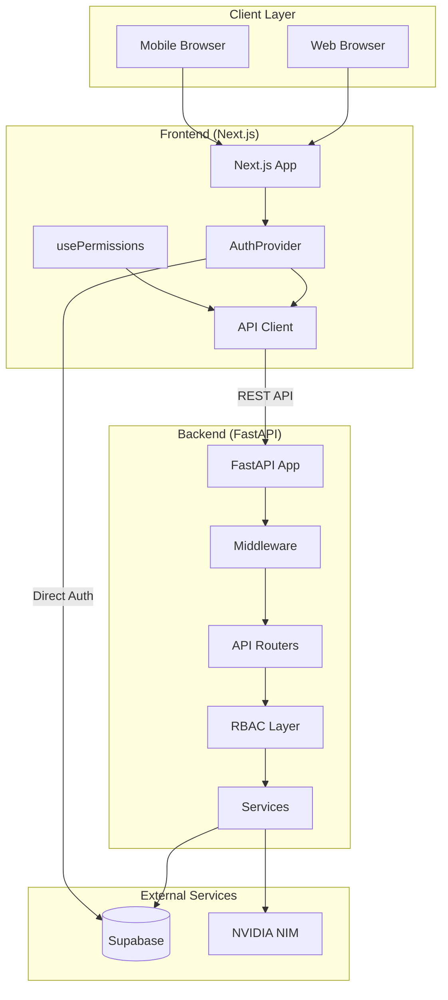
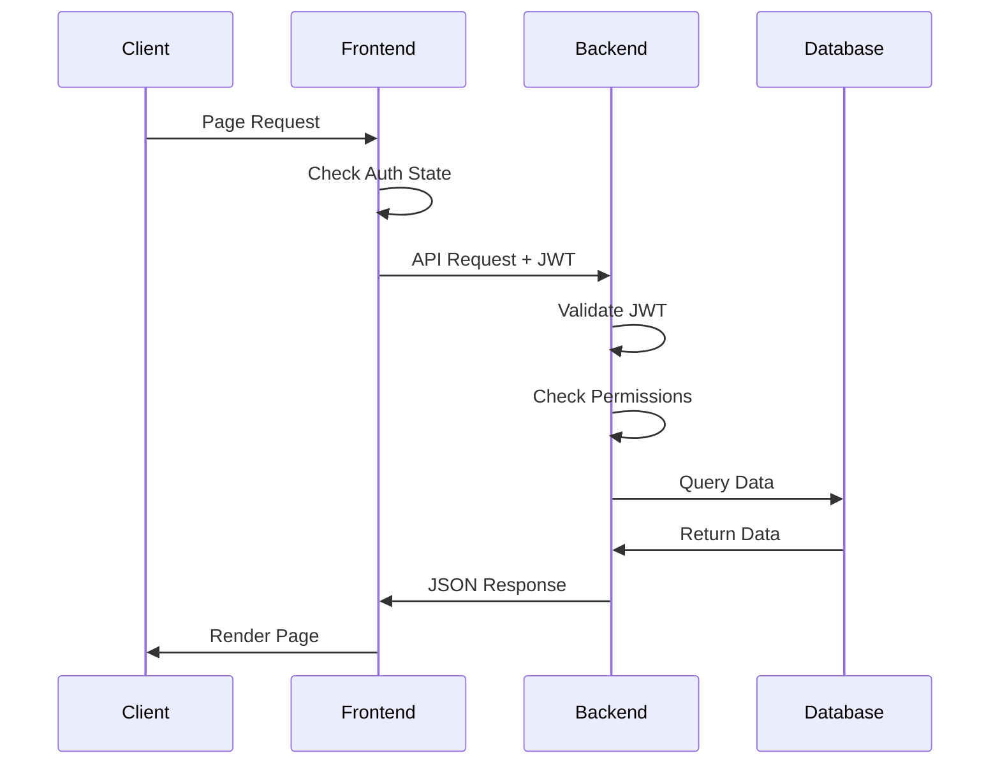
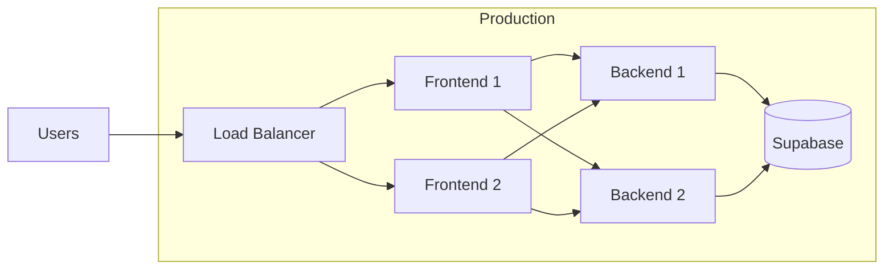

# Architecture Overview

High-level system architecture for Venus-System.

## System Architecture



---

## Component Overview

### Frontend (Next.js 14)

| Component | Purpose |
|-----------|---------|
| App Router | Client-side navigation |
| AuthProvider | Supabase authentication |
| usePermissions | Permission state management |
| API Client | Backend communication |
| PermissionGuard | Access control components |
| Admin Sidebar | Dynamic navigation |

### Backend (FastAPI)

| Component | Purpose |
|-----------|---------|
| Main App | Request routing |
| Middleware | Rate limiting, session tracking |
| Routers | API endpoints |
| Dependencies | Authentication, RBAC |
| Services | Business logic |
| Models | Data validation |

### Database (Supabase)

| Component | Purpose |
|-----------|---------|
| PostgreSQL | Data storage |
| Auth | User authentication |
| RLS | Row-level security |
| Triggers | Automated actions |
| Functions | Stored procedures |

---

## Request Flow



---

## Data Flow

### Authentication Flow

```
1. User enters credentials
2. Frontend → Supabase Auth
3. Supabase returns JWT
4. Frontend stores session
5. Frontend → Backend /record-session
6. Backend logs activity
7. Frontend → Backend /users/me
8. Backend returns permissions
```

### Business Operation Flow

```
1. User initiates action
2. Frontend checks permissions (client-side)
3. Frontend → Backend API
4. Backend validates JWT
5. Backend checks RBAC permissions
6. Backend validates store access
7. Service layer processes
8. Database enforces RLS
9. Audit log recorded
10. Response returned
```

---

## Deployment Architecture



---

## Security Layers

| Layer | Protection |
|-------|------------|
| **Network** | HTTPS, CORS |
| **Authentication** | JWT tokens, Supabase Auth |
| **Authorization** | RBAC (roles + permissions) |
| **Database** | RLS policies |
| **Application** | Input validation, rate limiting |
| **Audit** | Activity logging |

---

## Related Pages

- [[Backend-Overview]] - Backend details
- [[Frontend-Overview]] - Frontend details
- [[Authentication]] - Auth system
- [[Database-Schema]] - Data model
