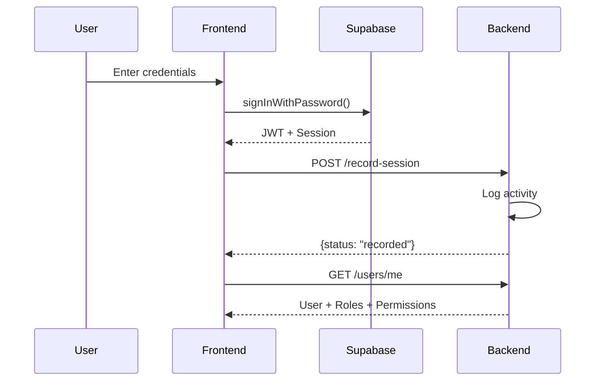

# Authentication System

The Venus-System implements a comprehensive authentication and authorization system using Supabase Auth with custom RBAC.

## Architecture

```
┌─────────────────┐     ┌──────────────────┐     ┌─────────────────┐
│   Frontend      │     │   FastAPI        │     │   Supabase      │
│   (Next.js)     │────▶│   Backend        │────▶│   Database      │
│                 │     │                  │     │                 │
│  AuthProvider   │     │  JWT Validation  │     │  auth.users     │
│  usePermissions │     │  RBAC Deps       │     │  profiles       │
│  PermissionGuard│     │  RoleService     │     │  user_roles     │
└─────────────────┘     └──────────────────┘     └─────────────────┘
```

## Authentication Flow

### Login Flow



### Token Validation

```python
# backend/app/dependencies/auth.py

async def get_current_user(credentials: HTTPAuthorizationCredentials):
    token = credentials.credentials
    
    payload = jwt.decode(
        token,
        settings.SUPABASE_JWT_SECRET,
        algorithms=["HS256"],
        audience="authenticated"
    )
    
    return {
        "id": payload.get("sub"),
        "email": payload.get("email"),
        "role": payload.get("role"),
    }
```

## Role-Based Access Control (RBAC)

### Database Schema

```
roles
├── id (PK)
├── name
└── description

permissions
├── id (PK)
├── key (unique)
└── description

role_permissions
├── role_id (FK)
└── permission_id (FK)

user_roles
├── user_id (FK to auth.users)
└── role_id (FK)
```

### Role Dependency

```python
# Usage in routers
@router.get("/admin", dependencies=[Depends(require_role(["Admin"]))])
async def admin_only():
    pass

@router.get("/users", dependencies=[Depends(require_permission(["users.read"]))])
async def list_users():
    pass
```

### Built-in Roles

| Role | Description |
|------|-------------|
| Admin | Full system access |
| Manager | Limited management access |
| Store Manager | Store-scoped access |
| User | Basic user access |

### Permission Format

Permissions follow the format: `<resource>.<action>`

Examples:
- `users.read` - Read user data
- `users.write` - Create/update users
- `roles.delete` - Delete roles
- `system.logs` - View audit logs
- `sales.create` - Create sales

## Frontend Integration

### AuthProvider

```typescript
// frontend/lib/auth/AuthProvider.tsx

export function AuthProvider({ children }) {
  const [user, setUser] = useState(null)
  
  const signIn = async (email, password) => {
    const { error } = await supabase.auth.signInWithPassword({
      email, password
    })
    if (error) throw error
    
    // Record session in backend
    await api.auth.recordSession()
  }
  
  const signOut = async () => {
    await api.auth.logout()  // Log before destroying session
    await supabase.auth.signOut()
    router.push('/auth/login')
  }
}
```

### Permission Hook

```typescript
// frontend/lib/auth/usePermissions.ts

export function usePermissions(): UserPermissions {
  const { user } = useAuth()
  
  useEffect(() => {
    if (user) {
      const userData = await api.users.getMe()
      setPermissions({
        roles: userData.roles,
        permissions: userData.permissions,
        store_ids: userData.store_ids,
      })
    }
  }, [user])
  
  return permissions
}
```

### Permission Guard

```tsx
// frontend/components/admin/PermissionGuard.tsx

export function PermissionGuard({ children, permission, fallback }) {
  const { permissions, loading } = usePermissions()
  
  if (loading) return <PageLoading />
  
  if (!hasPermission(permissions, permission)) {
    return fallback || <AccessDenied permission={permission} />
  }
  
  return <>{children}</>
}

// Usage
<PermissionGuard permission="users.read">
  <UserTable />
</PermissionGuard>
```

## Activity Logging

All authentication events are logged:

| Event | Trigger | Data Captured |
|-------|---------|---------------|
| `LOGIN` | Successful login | User ID, IP, User Agent |
| `LOGOUT` | User logout | User ID, IP, User Agent |
| `SIGNUP` | New registration | User ID, Email |
| `LOGIN_FAILURE` | Failed login | Attempted email, IP |
| `REFRESH_TOKEN` | Token refresh | User ID |

## Security Features

### Rate Limiting
- Role-based request limits
- Sliding window algorithm
- Configurable per-role

### Session Tracking
- IP address logging
- User agent parsing
- Device type detection
- Last activity tracking

### JWT Configuration
- HS256 algorithm
- 30-minute expiration
- Audience validation
- Secure secret key

## Related Pages

- [[RBAC-System]] - Detailed RBAC documentation
- [[API-Routers]] - Auth API endpoints
- [[Security-Best-Practices]] - Security guidelines
