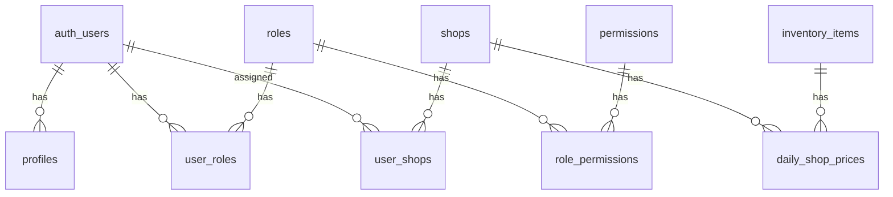

# Database Schema

The Venus-System uses **Supabase** (PostgreSQL) with Row Level Security (RLS).

## Schema Overview



---

## Core Tables

### profiles

User profile information linked to Supabase Auth.

```sql
CREATE TABLE profiles (
    id UUID PRIMARY KEY REFERENCES auth.users(id),
    email TEXT,
    full_name TEXT,
    avatar_url TEXT,
    last_sign_in_at TIMESTAMPTZ,
    created_at TIMESTAMPTZ DEFAULT NOW(),
    updated_at TIMESTAMPTZ DEFAULT NOW()
);
```

### roles

User roles for RBAC.

```sql
CREATE TABLE roles (
    id SERIAL PRIMARY KEY,
    name VARCHAR(50) UNIQUE NOT NULL,
    description TEXT,
    created_at TIMESTAMPTZ DEFAULT NOW()
);
```

**Default Roles:**
- Admin
- Manager
- Store Manager
- User

### permissions

Granular permissions.

```sql
CREATE TABLE permissions (
    id SERIAL PRIMARY KEY,
    key VARCHAR(100) UNIQUE NOT NULL,
    description TEXT,
    created_at TIMESTAMPTZ DEFAULT NOW()
);
```

### user_roles

User-role assignments.

```sql
CREATE TABLE user_roles (
    user_id UUID REFERENCES auth.users(id),
    role_id INTEGER REFERENCES roles(id),
    created_at TIMESTAMPTZ DEFAULT NOW(),
    PRIMARY KEY (user_id, role_id)
);
```

### role_permissions

Role-permission assignments.

```sql
CREATE TABLE role_permissions (
    role_id INTEGER REFERENCES roles(id),
    permission_id INTEGER REFERENCES permissions(id),
    PRIMARY KEY (role_id, permission_id)
);
```

---

## Business Tables

### shops

Store/shop locations.

```sql
CREATE TABLE shops (
    id SERIAL PRIMARY KEY,
    name VARCHAR(255) NOT NULL,
    location TEXT,
    timezone VARCHAR(50) DEFAULT 'UTC',
    is_active BOOLEAN DEFAULT true,
    maintenance_mode BOOLEAN DEFAULT false,
    created_at TIMESTAMPTZ DEFAULT NOW(),
    updated_at TIMESTAMPTZ DEFAULT NOW()
);
```

### user_shops

User-store assignments for multi-tenant access.

```sql
CREATE TABLE user_shops (
    user_id UUID REFERENCES auth.users(id),
    shop_id INTEGER REFERENCES shops(id),
    PRIMARY KEY (user_id, shop_id)
);
```

### inventory_items

Product catalog.

```sql
CREATE TABLE inventory_items (
    id SERIAL PRIMARY KEY,
    name VARCHAR(255) NOT NULL,
    sku VARCHAR(100) UNIQUE,
    category VARCHAR(100),
    base_price DECIMAL(10, 2) DEFAULT 0.00,
    unit VARCHAR(50) DEFAULT 'piece',
    item_type VARCHAR(20) DEFAULT 'sale',
    is_active BOOLEAN DEFAULT true,
    created_at TIMESTAMPTZ DEFAULT NOW(),
    updated_at TIMESTAMPTZ DEFAULT NOW()
);
```

### daily_shop_prices

Shop-specific daily pricing.

```sql
CREATE TABLE daily_shop_prices (
    id SERIAL PRIMARY KEY,
    shop_id INTEGER REFERENCES shops(id),
    item_id INTEGER REFERENCES inventory_items(id),
    valid_date DATE NOT NULL,
    price DECIMAL(10, 2) NOT NULL,
    UNIQUE (shop_id, item_id, valid_date)
);
```

---

## System Tables

### system_settings

Key-value configuration store.

```sql
CREATE TABLE system_settings (
    id SERIAL PRIMARY KEY,
    key VARCHAR(100) UNIQUE NOT NULL,
    value JSONB,
    description TEXT,
    updated_by UUID REFERENCES auth.users(id),
    updated_at TIMESTAMPTZ DEFAULT NOW()
);
```

### audit_logs

System change audit trail.

```sql
CREATE TABLE audit_logs (
    id BIGSERIAL PRIMARY KEY,
    user_id UUID REFERENCES auth.users(id),
    action VARCHAR(50) NOT NULL,
    resource_type VARCHAR(100),
    resource_id TEXT,
    ip_address TEXT,
    user_agent TEXT,
    metadata JSONB,
    created_at TIMESTAMPTZ DEFAULT NOW()
);
```

### app_activity_logs

User authentication activity tracking.

```sql
CREATE TABLE app_activity_logs (
    id BIGSERIAL PRIMARY KEY,
    user_id UUID REFERENCES profiles(id),
    event_type TEXT NOT NULL,
    status TEXT DEFAULT 'SUCCESS',
    ip_address TEXT,
    user_agent TEXT,
    browser TEXT,
    os TEXT,
    device_type TEXT,
    location_city TEXT,
    location_country TEXT,
    metadata JSONB,
    timestamp TIMESTAMPTZ DEFAULT NOW()
);
```

### user_sessions

Active session tracking.

```sql
CREATE TABLE user_sessions (
    id SERIAL PRIMARY KEY,
    user_id UUID REFERENCES auth.users(id),
    ip_address TEXT,
    user_agent TEXT,
    device_type TEXT,
    browser TEXT,
    last_activity_at TIMESTAMPTZ,
    expires_at TIMESTAMPTZ
);
```

### rate_limit_configs

Role-based rate limiting configuration.

```sql
CREATE TABLE rate_limit_configs (
    id SERIAL PRIMARY KEY,
    role_id INTEGER REFERENCES roles(id) UNIQUE,
    requests_per_minute INTEGER DEFAULT 60,
    requests_per_hour INTEGER DEFAULT 1000,
    enabled BOOLEAN DEFAULT true,
    updated_at TIMESTAMPTZ DEFAULT NOW()
);
```

---

## AI Tables

### ai_agent_configs

AI assistant configuration.

```sql
CREATE TABLE ai_agent_configs (
    id SERIAL PRIMARY KEY,
    agent_name VARCHAR(100) UNIQUE NOT NULL,
    is_enabled BOOLEAN DEFAULT true,
    allowed_tables TEXT[],
    rate_limit_per_minute INTEGER DEFAULT 10,
    system_prompt TEXT,
    metadata JSONB,
    updated_at TIMESTAMPTZ DEFAULT NOW()
);
```

### ai_knowledge_base

RAG knowledge documents.

```sql
CREATE TABLE ai_knowledge_base (
    id SERIAL PRIMARY KEY,
    title VARCHAR(255) NOT NULL,
    content TEXT NOT NULL,
    category VARCHAR(100),
    embedding vector(1536),
    created_at TIMESTAMPTZ DEFAULT NOW()
);
```

---

## Poultry Tables

See [[Poultry-Overview]] for complete documentation of:

- `suppliers`
- `purchases`
- `purchase_items`
- `inventory_ledger`
- `skus`
- `sku_pricing`
- `sales`
- `sale_items`
- `settlements`
- `staff_points`
- `staff_point_history`
- `staff_performance`
- `customers`
- `customer_ledger`
- `receipts`
- `payments`
- `expenses`
- And more...

---

## Related Pages

- [[Migrations-Reference]] - All 81 migrations
- [[RLS-Policies]] - Row Level Security
- [[Poultry-Overview]] - Poultry module tables
