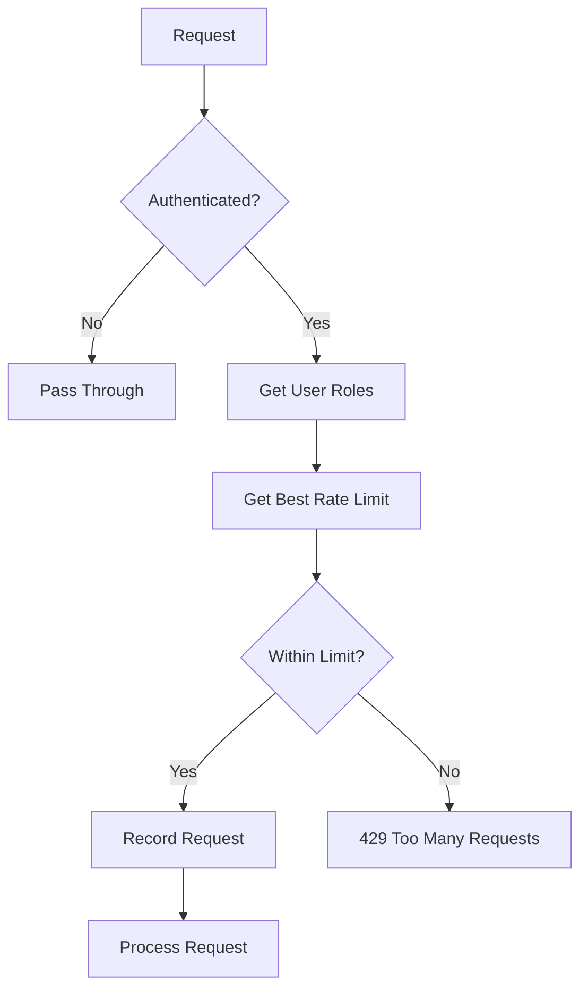

# Middleware

The Venus-System backend includes custom middleware for request processing.

## Middleware Stack

```python
# Order of execution (first to last)
app.add_middleware(CORSMiddleware, ...)
app.add_middleware(SessionTrackerMiddleware)
app.add_middleware(RateLimiterMiddleware)
```

---

## CORS Middleware

**Built-in FastAPI/Starlette middleware**

### Configuration

```python
app.add_middleware(
    CORSMiddleware,
    allow_origins=settings.ALLOWED_ORIGINS,
    allow_credentials=True,
    allow_methods=["*"],
    allow_headers=["*"],
)
```

### Environment Variables

```bash
ALLOWED_ORIGINS=["http://localhost:3000","http://127.0.0.1:3000"]
```

---

## Rate Limiter Middleware

**File:** `backend/app/middleware/rate_limiter.py`

Role-based rate limiting using sliding window algorithm.

### Architecture



### Components

#### RateLimitStore

In-memory sliding window storage:

```python
class RateLimitStore:
    minute_requests: Dict[str, List[datetime]]
    hour_requests: Dict[str, List[datetime]]
    
    async def record_request(self, user_id: str)
    async def get_request_counts(self, user_id: str) -> Tuple[int, int]
```

#### RateLimitConfigCache

Cached database configurations:

```python
class RateLimitConfigCache:
    cache: Dict[int, dict]  # role_id -> config
    ttl: timedelta = 60 seconds
    
    async def get_config(self, role_id: int) -> Optional[dict]
```

### Configuration Table

```sql
CREATE TABLE rate_limit_configs (
    id SERIAL PRIMARY KEY,
    role_id INTEGER REFERENCES roles(id),
    requests_per_minute INTEGER DEFAULT 60,
    requests_per_hour INTEGER DEFAULT 1000,
    enabled BOOLEAN DEFAULT true
);
```

### Response Headers

| Header | Description |
|--------|-------------|
| `X-RateLimit-Limit-Minute` | Max requests per minute |
| `X-RateLimit-Limit-Hour` | Max requests per hour |
| `X-RateLimit-Remaining-Minute` | Remaining this minute |
| `X-RateLimit-Remaining-Hour` | Remaining this hour |

### Excluded Paths

```python
EXCLUDED_PATHS = {
    '/health',
    '/docs',
    '/redoc',
    '/openapi.json',
    '/',
}
```

### Rate Limit Response

```json
{
    "detail": "Rate limit exceeded. Max 60 requests per minute.",
    "retry_after": 60
}
```

---

## Session Tracker Middleware

**File:** `backend/app/middleware/session_tracker.py`

Tracks active user sessions with device information.

### Features

- IP address detection (supports X-Forwarded-For)
- User agent parsing
- Device type detection
- Browser identification
- Session deduplication

### User Agent Parsing

```python
def parse_user_agent(user_agent: str) -> dict:
    # Device Type
    if 'mobile' in ua_lower:
        device_type = 'Mobile'
    elif 'tablet' in ua_lower:
        device_type = 'Tablet'
    else:
        device_type = 'Desktop'
    
    # Browser
    if 'chrome' in ua_lower:
        browser = 'Chrome'
    elif 'firefox' in ua_lower:
        browser = 'Firefox'
    # ... etc
    
    return {'device_type': device_type, 'browser': browser}
```

### IP Detection

```python
def get_client_ip(request: Request) -> str:
    # Check proxy headers first
    forwarded_for = request.headers.get('X-Forwarded-For')
    if forwarded_for:
        return forwarded_for.split(',')[0].strip()
    
    real_ip = request.headers.get('X-Real-IP')
    if real_ip:
        return real_ip
    
    # Fall back to client
    return request.client.host if request.client else 'Unknown'
```

### Session Table

```sql
CREATE TABLE user_sessions (
    id SERIAL PRIMARY KEY,
    user_id UUID REFERENCES auth.users(id),
    ip_address TEXT,
    user_agent TEXT,
    device_type TEXT,
    browser TEXT,
    last_activity_at TIMESTAMPTZ,
    expires_at TIMESTAMPTZ
);
```

### Deduplication Logic

Sessions are deduplicated by:
- `user_id`
- `ip_address`
- `user_agent`

If a matching session exists, it's updated rather than creating a new one.

---

## Error Handling

Both middleware implement graceful fallback:

```python
try:
    # Process request
except Exception as e:
    logger.error(f"Middleware error: {e}")
    # Allow request to proceed
    return await call_next(request)
```

This ensures middleware failures don't block legitimate requests.

---

## Related Pages

- [[Backend-Overview]] - Backend architecture
- [[Authentication]] - Auth integration
- [[API-Routers]] - Endpoint documentation
