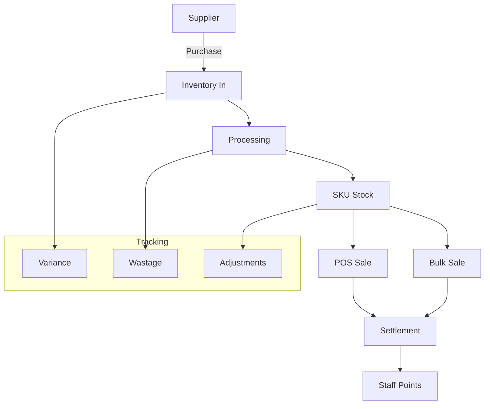

# Poultry Retail Module

Complete documentation for the Venus Chicken poultry retail business module.

## Overview

The Poultry Retail module is a comprehensive business management system for chicken retail operations, covering the entire workflow from purchase to sale.

## Business Flow



---

## Module Structure

### Backend Routers

**Location:** `backend/app/routers/poultry_retail/`

| Router | File | Endpoints | Purpose |
|--------|------|-----------|---------|
| Suppliers | `suppliers.py` | 4 | Supplier management |
| Purchases | `purchases.py` | 6 | Purchase orders |
| Inventory | `inventory.py` | 5 | Stock management |
| Processing | `processing.py` | 4 | Bird processing |
| SKUs | `skus.py` | 6 | Product catalog |
| Sales | `sales.py` | 8 | POS and bulk sales |
| Settlements | `settlements.py` | 7 | Daily reconciliation |
| Variance | `variance.py` | 5 | Stock variance |
| Staff Points | `staff_points.py` | 6 | Performance points |
| Grading | `grading.py` | 5 | Staff grading |
| Customers | `customers.py` | 5 | Customer accounts |
| Receipts | `receipts.py` | 4 | Receipt management |
| Payments | `payments.py` | 5 | Payment tracking |
| Ledger | `ledger.py` | 4 | Financial ledger |
| Expenses | `expenses.py` | 5 | Expense tracking |
| Scheduled Tasks | `scheduled_tasks.py` | 3 | Cron jobs |

---

## Core Concepts

### Bird Types

```sql
CREATE TYPE bird_type AS ENUM (
    'BROILER',      -- Standard broiler chicken
    'LAYER',        -- Layer/egg chicken
    'COUNTRY',      -- Country/desi chicken
    'KADAKNATH'     -- Premium Kadaknath
);
```

### Cut Types

```sql
CREATE TYPE cut_type AS ENUM (
    'FULL',         -- Whole bird
    'HALF',         -- Half bird
    'QUARTER',      -- Quarter bird
    'BREAST',       -- Breast piece
    'LEG',          -- Leg piece
    'WING',         -- Wing piece
    'DRUMSTICK',    -- Drumstick
    'BONELESS',     -- Boneless meat
    'LIVER',        -- Offal - liver
    'GIZZARD'       -- Offal - gizzard
);
```

### Inventory Types

```sql
CREATE TYPE inventory_type AS ENUM (
    'LIVE',         -- Live birds (counted in numbers)
    'PROCESSED',    -- Processed meat (measured in kg)
    'BYPRODUCT'     -- Byproducts like offal
);
```

---

## API Reference

### Suppliers (`/api/v1/poultry/suppliers`)

| Method | Endpoint | Description | Permission |
|--------|----------|-------------|------------|
| `GET` | `/` | List all suppliers | `suppliers.sidebar` |
| `GET` | `/{id}` | Get supplier details | `suppliers.sidebar` |
| `POST` | `/` | Create supplier | `suppliers.create` |
| `PUT` | `/{id}` | Update supplier | `suppliers.update` |

### Purchases (`/api/v1/poultry/purchases`)

| Method | Endpoint | Description | Permission |
|--------|----------|-------------|------------|
| `GET` | `/` | List purchases | `purchases.sidebar` |
| `GET` | `/{id}` | Get purchase details | `purchases.sidebar` |
| `POST` | `/` | Create purchase | `purchases.create` |
| `PUT` | `/{id}` | Update purchase | `purchases.update` |
| `DELETE` | `/{id}` | Delete purchase | `purchases.delete` |
| `POST` | `/{id}/receive` | Mark as received | `purchases.receive` |

### Inventory (`/api/v1/poultry/inventory`)

| Method | Endpoint | Description | Permission |
|--------|----------|-------------|------------|
| `GET` | `/stock` | Get current stock | `inventory.stock.sidebar` |
| `GET` | `/ledger` | Get inventory ledger | `inventory.ledger.sidebar` |
| `POST` | `/adjustments` | Create adjustment | `inventory.adjustments.create` |
| `GET` | `/adjustments` | List adjustments | `inventory.adjustments.sidebar` |

### Processing (`/api/v1/poultry/processing`)

| Method | Endpoint | Description | Permission |
|--------|----------|-------------|------------|
| `GET` | `/` | List processing entries | `processing.sidebar` |
| `POST` | `/` | Create processing entry | `processing.create` |
| `GET` | `/wastage-configs` | Get wastage configs | `wastageconfig.sidebar` |
| `PUT` | `/wastage-configs/{id}` | Update wastage config | `wastageconfig.update` |

### SKUs (`/api/v1/poultry/skus`)

| Method | Endpoint | Description | Permission |
|--------|----------|-------------|------------|
| `GET` | `/` | List SKUs | `skus.sidebar` |
| `GET` | `/{id}` | Get SKU details | `skus.sidebar` |
| `POST` | `/` | Create SKU | `skus.create` |
| `PUT` | `/{id}` | Update SKU | `skus.update` |
| `GET` | `/pricing/{store_id}` | Get store pricing | `skus.sidebar` |
| `PUT` | `/pricing/{store_id}` | Update pricing | `skus.update` |

### Sales (`/api/v1/poultry/sales`)

| Method | Endpoint | Description | Permission |
|--------|----------|-------------|------------|
| `POST` | `/` | Create sale | `sales.create` |
| `GET` | `/` | List sales | `sales.history.sidebar` |
| `GET` | `/{id}` | Get sale details | `sales.history.sidebar` |
| `GET` | `/daily-summary` | Daily sales summary | `sales.history.sidebar` |
| `POST` | `/void/{id}` | Void a sale | `sales.void` |
| `POST` | `/refund/{id}` | Refund a sale | `sales.refund` |

### Settlements (`/api/v1/poultry/settlements`)

| Method | Endpoint | Description | Permission |
|--------|----------|-------------|------------|
| `GET` | `/` | List settlements | `settlements.sidebar` |
| `GET` | `/{id}` | Get settlement details | `settlements.sidebar` |
| `POST` | `/` | Create settlement | `settlements.create` |
| `POST` | `/{id}/submit` | Submit settlement | `settlements.submit` |
| `POST` | `/{id}/approve` | Approve settlement | `settlements.approve` |
| `GET` | `/pending` | Get pending settlements | `settlements.sidebar` |

### Variance (`/api/v1/poultry/variance`)

| Method | Endpoint | Description | Permission |
|--------|----------|-------------|------------|
| `GET` | `/` | List variance entries | `variance.sidebar` |
| `GET` | `/{id}` | Get variance details | `variance.sidebar` |
| `POST` | `/{id}/approve` | Approve variance | `variance.approve` |
| `POST` | `/{id}/deduct` | Deduct from staff | `variance.deductpoints` |
| `GET` | `/summary` | Variance summary | `variance.sidebar` |

### Staff Points (`/api/v1/poultry/staff-points`)

| Method | Endpoint | Description | Permission |
|--------|----------|-------------|------------|
| `GET` | `/my` | Get my points | Authenticated |
| `GET` | `/store/{store_id}` | Get store staff points | `staffpoints.view` |
| `POST` | `/add` | Add points | `staffpoints.add` |
| `POST` | `/deduct` | Deduct points | `staffpoints.deduct` |
| `GET` | `/leaderboard` | Get leaderboard | `staffpoints.view` |
| `GET` | `/history/{user_id}` | Get point history | `staffpoints.view` |

---

## Database Tables

### Core Tables

| Table | Purpose |
|-------|---------|
| `suppliers` | Supplier master data |
| `purchases` | Purchase orders |
| `purchase_items` | Purchase line items |
| `inventory_ledger` | Stock movements |
| `skus` | Product catalog |
| `sku_pricing` | Store-specific pricing |
| `sales` | Sales transactions |
| `sale_items` | Sale line items |

### Settlement Tables

| Table | Purpose |
|-------|---------|
| `settlements` | Daily reconciliation |
| `settlement_lines` | Settlement line items |
| `variance_entries` | Stock discrepancies |

### Staff Tables

| Table | Purpose |
|-------|---------|
| `staff_points` | Current point balance |
| `staff_point_history` | Point transaction history |
| `staff_performance` | Monthly performance metrics |
| `staff_grades` | Grade thresholds |

### Customer Tables

| Table | Purpose |
|-------|---------|
| `customers` | Customer master |
| `customer_ledger` | Credit/debit history |
| `receipts` | Payment receipts |
| `payments` | Payment records |

### Processing Tables

| Table | Purpose |
|-------|---------|
| `processing_entries` | Processing records |
| `wastage_configs` | Yield configurations |

---

## Related Pages

- [[API-Routers]] - All API endpoints
- [[Database-Schema]] - Table structures
- [[Migrations-Reference]] - Migration files
