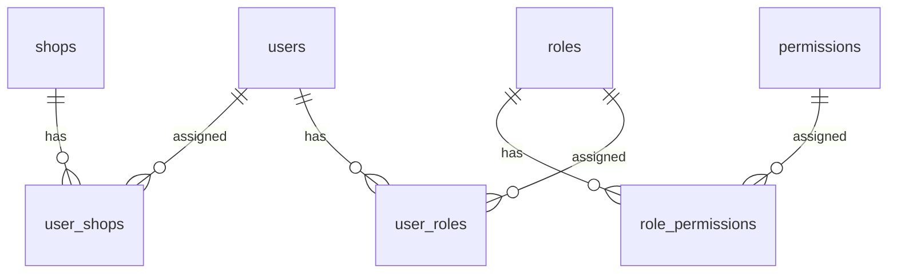

# RBAC System

Complete documentation for the Role-Based Access Control system.

## Architecture



## Core Components

### Backend Dependencies

**Location:** `backend/app/dependencies/`

| File | Function | Purpose |
|------|----------|---------|
| `auth.py` | `get_current_user` | JWT validation |
| `rbac.py` | `require_role` | Role-based protection |
| `rbac.py` | `require_permission` | Permission-based protection |

---

## Roles

### Default Roles

| Role | Description | Scope |
|------|-------------|-------|
| Admin | Full system access | Global |
| Manager | Department management | Global |
| Store Manager | Store-specific access | Store-scoped |
| User | Basic user access | Personal |

### Role Assignment

```python
# Assign role to user
role_service = RoleService()
await role_service.assign_role_to_user(user_id, role_id)

# Remove role from user
await role_service.remove_role_from_user(user_id, role_id)
```

---

## Permissions

### Permission Format

```
<resource>.<action>
```

Examples:
- `users.read` - Read users
- `users.write` - Create/update users
- `users.delete` - Delete users
- `users.field.email` - View email field

### Permission Categories

| Category | Permissions |
|----------|-------------|
| System | `systemdashboard.view`, `systemadministration.view`, `system.admin`, `system.settings`, `system.logs`, `system.docs`, `system.status` |
| Users | `users.read`, `users.write`, `users.delete`, `users.field.*` |
| Roles | `roles.read`, `roles.write`, `roles.delete` |
| Permissions | `permissions.read`, `permissions.write`, `permissions.delete` |
| Business | `businessmanagement.view`, `shops.*`, `managers.*`, `priceconfig.*` |
| Inventory | `inventory.*`, `skus.*`, `processing.*`, `wastageconfig.*` |
| Sales | `sales.*`, `customer.*`, `receipt.*`, `payment.*` |
| Finance | `expense.*`, `cashbook.*`, `settlements.*`, `variance.*` |
| Staff | `staffpoints.*`, `grading.*` |
| AI | `ai.admin` |

### Field-Level Permissions

Enable granular field access:

```python
# Configuration
USER_FIELD_CONFIG = {
    "email": "users.field.email",
    "full_name": "users.field.name",
    "roles": "users.field.roles",
    "permissions": "users.field.permissions",
}

# Filter fields based on permissions
return filter_fields(user_data, user_permissions, USER_FIELD_CONFIG, ALWAYS_INCLUDE)
```

---

## Implementation

### Protecting Routes

```python
from app.dependencies.rbac import require_role, require_permission

# Role-based protection
@router.get("/admin", dependencies=[Depends(require_role(["Admin"]))])
async def admin_only():
    pass

# Permission-based protection
@router.get("/users", dependencies=[Depends(require_permission(["users.read"]))])
async def list_users():
    pass

# Multiple permissions (all required)
@router.post(
    "/sensitive",
    dependencies=[Depends(require_permission(["users.write", "system.admin"]))]
)
async def sensitive_operation():
    pass
```

### Enriched User Object

After RBAC checks, the user object is enriched:

```python
current_user = {
    "id": "uuid",
    "email": "user@example.com",
    "roles": ["Admin", "Manager"],
    "store_ids": [1, 2, 3],
    "user_id": "uuid"  # Compatibility alias
}
```

### Store-Scoped Access

For multi-tenant operations:

```python
def validate_store_access(store_id: int, user: dict) -> bool:
    # Admins can access all stores
    if "Admin" in user.get("roles", []):
        return True
    # Others only their assigned stores
    return store_id in user.get("store_ids", [])
```

---

## Frontend Integration

### PermissionGuard Component

```tsx
<PermissionGuard permission="users.read">
  <UserTable />
</PermissionGuard>
```

### Sidebar Filtering

Navigation items are filtered based on permissions:

```tsx
const systemAdministrationGroup = {
  name: 'System Administration',
  permission: 'systemadministration.view',
  items: [
    { name: 'Users', href: '/admin/users', permission: 'users.read' },
    { name: 'Roles', href: '/admin/roles', permission: 'roles.read' },
    // ...
  ]
}
```

### Permission Hooks

```tsx
const { permissions, roles, store_ids, loading } = usePermissions()

if (hasPermission(permissions, 'users.read')) {
  // Show user management
}

if (hasRole(roles, 'Admin')) {
  // Show admin features
}
```

---

## Database Schema

### Tables

```sql
-- Roles
CREATE TABLE roles (
    id SERIAL PRIMARY KEY,
    name VARCHAR(50) UNIQUE NOT NULL,
    description TEXT
);

-- Permissions
CREATE TABLE permissions (
    id SERIAL PRIMARY KEY,
    key VARCHAR(100) UNIQUE NOT NULL,
    description TEXT
);

-- User-Role assignments
CREATE TABLE user_roles (
    user_id UUID REFERENCES auth.users(id),
    role_id INTEGER REFERENCES roles(id),
    PRIMARY KEY (user_id, role_id)
);

-- Role-Permission assignments
CREATE TABLE role_permissions (
    role_id INTEGER REFERENCES roles(id),
    permission_id INTEGER REFERENCES permissions(id),
    PRIMARY KEY (role_id, permission_id)
);

-- User-Store assignments
CREATE TABLE user_shops (
    user_id UUID REFERENCES auth.users(id),
    shop_id INTEGER REFERENCES shops(id),
    PRIMARY KEY (user_id, shop_id)
);
```

---

## Best Practices

1. **Principle of Least Privilege** - Grant minimum required permissions
2. **Use Permissions over Roles** - More granular control
3. **Field-Level Security** - Protect sensitive data fields
4. **Store Scoping** - Enforce multi-tenant isolation
5. **Audit Logging** - Track permission changes

---

## Related Pages

- [[Authentication]] - Auth system
- [[API-Routers]] - Protected endpoints
- [[Database-Schema]] - Table structures
