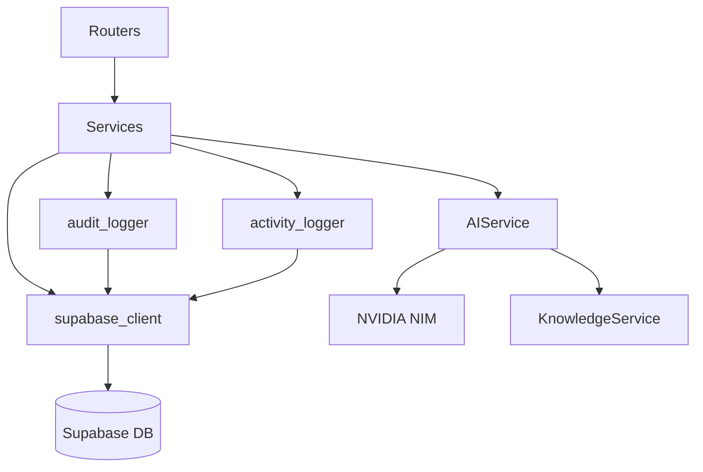

# Services Layer

The services layer contains the business logic for the Venus-System backend.

## Services Overview

| Service | File | Purpose |
|---------|------|---------|
| `SupabaseClient` | `supabase_client.py` | Database singleton client |
| `UserService` | `user_service.py` | User CRUD operations |
| `RoleService` | `role_service.py` | RBAC management |
| `AuditLogger` | `audit_service.py` | Audit trail logging |
| `ActivityLogger` | `activity_service.py` | Auth event logging |
| `AIService` | `ai_service.py` | NVIDIA NIM integration |
| `KnowledgeService` | `knowledge_service.py` | RAG knowledge base |

---

## SupabaseClient

**File:** `backend/app/services/supabase_client.py`

Singleton pattern for database access:

```python
class SupabaseClient:
    _instance: Client = None
    
    @classmethod
    def get_client(cls) -> Client:
        if cls._instance is None:
            cls._instance = create_client(
                settings.SUPABASE_URL,
                settings.SUPABASE_SERVICE_ROLE_KEY
            )
        return cls._instance

# Global instance
supabase_client = SupabaseClient.get_client()
```

**Usage:**
```python
from app.services.supabase_client import supabase_client

# Query
result = supabase_client.table("users").select("*").execute()

# Insert
supabase_client.table("logs").insert({"action": "test"}).execute()
```

---

## UserService

**File:** `backend/app/services/user_service.py`

### Methods

| Method | Description |
|--------|-------------|
| `get_user_by_id(user_id)` | Get user profile by ID |
| `get_all_users(limit, offset)` | List users with pagination |
| `update_user(user_id, data)` | Update user profile |
| `delete_user(user_id)` | Delete user |
| `search_users(query)` | Search by email/name |

### Example

```python
user_service = UserService()

# Get user
profile = await user_service.get_user_by_id("uuid-here")

# Update
updated = await user_service.update_user("uuid", UserUpdate(full_name="New Name"))
```

---

## RoleService

**File:** `backend/app/services/role_service.py`

Handles all RBAC operations.

### Role Methods

| Method | Description |
|--------|-------------|
| `get_all_roles()` | List all roles |
| `get_role_by_id(role_id)` | Get role details |
| `create_role(data)` | Create new role |
| `update_role(role_id, data)` | Update role |
| `delete_role(role_id)` | Delete role |

### User-Role Methods

| Method | Description |
|--------|-------------|
| `get_user_roles(user_id)` | Get user's roles |
| `assign_role_to_user(user_id, role_id)` | Assign role |
| `remove_role_from_user(user_id, role_id)` | Remove role |

### Permission Methods

| Method | Description |
|--------|-------------|
| `get_all_permissions()` | List all permissions |
| `get_user_permissions(user_id)` | Get user's permissions |
| `get_role_permissions(role_id)` | Get role's permissions |
| `assign_permission_to_role(role_id, perm_id)` | Assign permission |
| `remove_permission_from_role(role_id, perm_id)` | Remove permission |

### Store Access

| Method | Description |
|--------|-------------|
| `get_user_store_ids(user_id)` | Get assigned store IDs |

---

## AuditLogger

**File:** `backend/app/services/audit_service.py`

Records system-wide state changes for compliance.

### Usage

```python
from app.services.audit_service import audit_logger

await audit_logger.log_action(
    user_id="uuid",
    action="CREATE",
    resource_type="role",
    resource_id="123",
    metadata={"name": "New Role"}
)
```

### Action Types

| Action | Description |
|--------|-------------|
| `CREATE` | Resource created |
| `UPDATE` | Resource modified |
| `DELETE` | Resource removed |
| `LOGIN` | User logged in |
| `LOGOUT` | User logged out |

---

## ActivityLogger

**File:** `backend/app/services/activity_service.py`

Enterprise-grade authentication event logging.

### Usage

```python
from app.services.activity_service import activity_logger

await activity_logger.log_activity(
    user_id="uuid",
    event_type="LOGIN",
    status="SUCCESS",
    request=request,  # FastAPI Request object
    metadata={"email": "user@example.com"}
)
```

### Event Types

| Event | Status | Description |
|-------|--------|-------------|
| `LOGIN` | SUCCESS | Successful login |
| `LOGIN` | FAILED | Failed login attempt |
| `LOGOUT` | SUCCESS | User logout |
| `SIGNUP` | SUCCESS | New registration |
| `REFRESH_TOKEN` | SUCCESS | Token refreshed |

### Captured Metadata

- IP Address
- User Agent
- Browser (Chrome, Firefox, Safari, Edge)
- OS (Windows, macOS, Linux, iOS, Android)
- Device Type (Desktop, Mobile, Tablet)

---

## AIService

**File:** `backend/app/services/ai_service.py`

Integrates with NVIDIA NIM API for AI assistant features.

### Key Features

- Chat completions with LLaMA 3.3 70B
- Function calling for database queries
- RAG (Retrieval Augmented Generation)
- Configurable access control per table

### Configuration

```python
# Database tables AI can access
allowed_tables = [
    "shops", "skus", "sales", "inventory_ledger",
    "settlements", "staff_points", "customers"
]
```

### Tools Available to AI

| Tool | Description |
|------|-------------|
| `discover_tables` | List accessible tables |
| `get_table_schema` | Get table structure |
| `query_database` | Execute read-only queries |
| `search_knowledge` | Search knowledge base |

---

## KnowledgeService

**File:** `backend/app/services/knowledge_service.py`

Manages the RAG knowledge base for AI.

### Methods

| Method | Description |
|--------|-------------|
| `search(query)` | Search knowledge base |
| `add_document(doc)` | Add new document |
| `list_documents()` | List all documents |
| `delete_document(id)` | Remove document |

---

## Service Dependencies



## Related Pages

- [[Backend-Overview]] - Backend architecture
- [[API-Routers]] - Route handlers
- [[Authentication]] - Auth system
